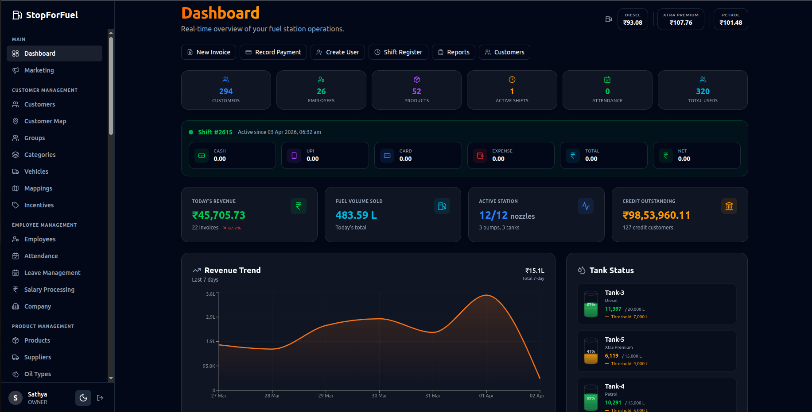
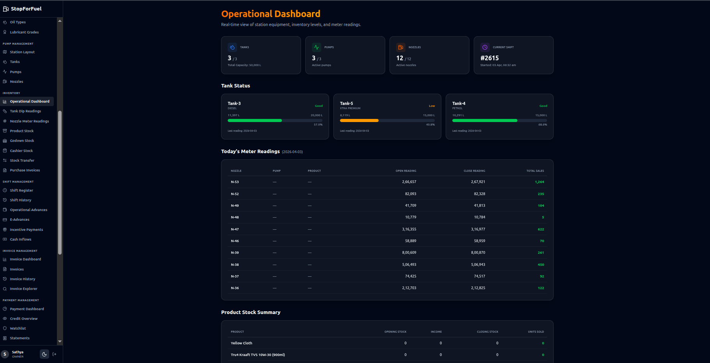
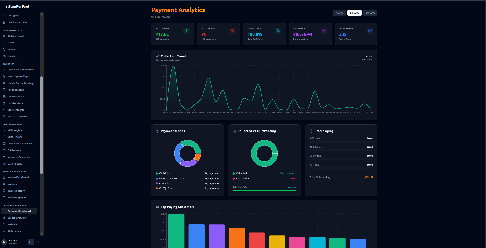
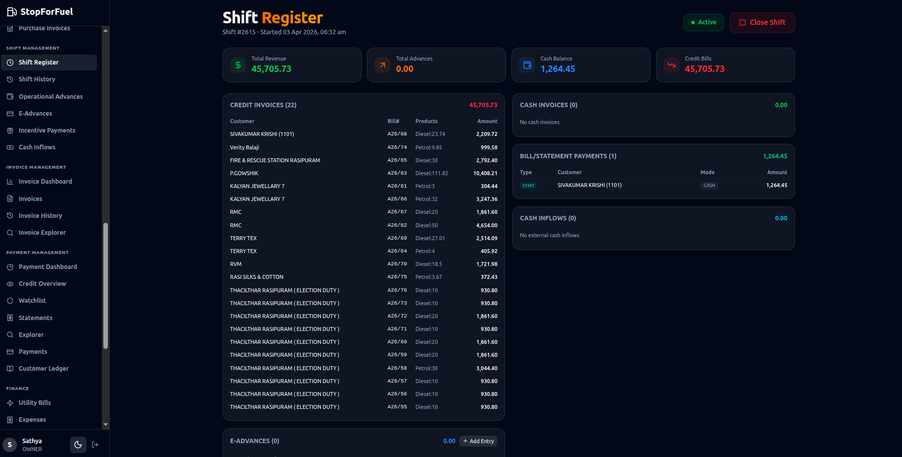
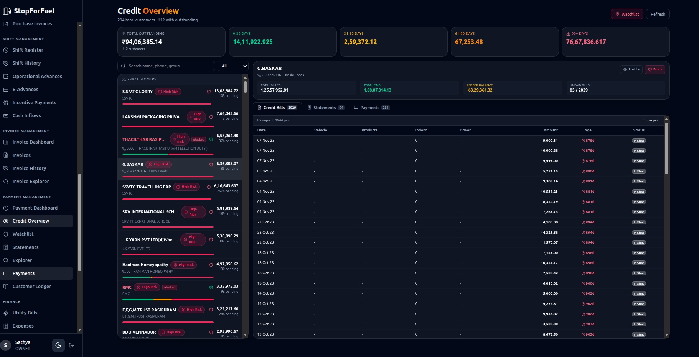
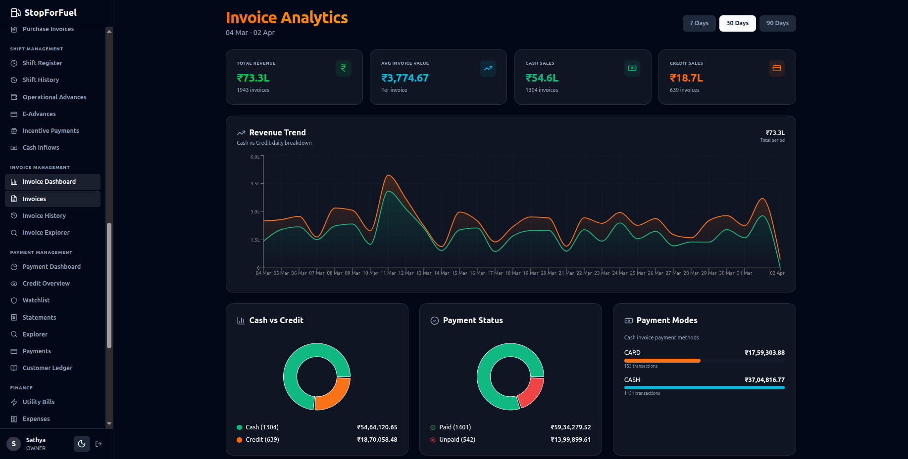

<p align="center">
  
</p>

<h1 align="center">StopForFuel</h1>

<p align="center">
  <strong>Full-stack fuel station management platform — production-deployed on AWS</strong>
</p>

<p align="center">
  
  
  
  
  
  
  
  
  
  
</p>

---

## Overview

**StopForFuel** is a production-deployed, multi-tenant fuel station management platform that digitizes the complete business lifecycle — from daily shift operations and fuel inventory tracking to B2B credit invoicing, payment reconciliation, and employee management.

Built with a modern stack (Spring Boot + Next.js + Kotlin/Compose), deployed on AWS with Terraform-managed infrastructure, and backed by a CI/CD pipeline that auto-deploys on merge.

### At a Glance

| Metric | Count |
|--------|-------|
| REST API Controllers | 61 |
| Domain Entities | 71 |
| JPA Repositories | 64 |
| Service Classes | 67 |
| Frontend Pages | 71 |
| Terraform Modules | 9 |

---

## Screenshots

<!-- Add your screenshots to docs/screenshots/ and they will render here -->

### Dashboard
<p align="center">
  
</p>

### Operational Dashboard
<p align="center">
  
</p>

### Payment Dashboard
<p align="center">
  
</p>

### Shift Closing Report
<p align="center">
  
</p>

### Credit Management
<p align="center">
  
</p>

### Invoice Analytics
<p align="center">
  
</p>

### Dark Mode
<!-- <p align="center">
  
</p> -->

> **Note:** Place your screenshots in `docs/screenshots/` with the filenames above, or update the paths to match your files.

---

## Features

### Shift Management
- Complete shift lifecycle: **OPEN → REVIEW → CLOSED** with automated closing reports
- Transaction tracking across 7 payment modes: Cash, Card, UPI, CCMS, Cheque, Bank Transfer, Expense
- Cashier workspace with real-time totals and discrepancy detection
- Shift reopen flow for corrections

### Fuel Inventory
- Real-time tank dip readings, nozzle meter readings, and product stock tracking
- Automatic sale calculations from opening/closing readings
- Godown stock, cashier stock, and stock transfer management
- Purchase orders and supplier integration

### Credit & Payments
- B2B credit customer management with configurable credit limits (amount, liters, aging)
- Auto-block system when limits exceeded
- Statement generation from unlinked credit bills with date/vehicle/product filters
- Full debit/credit ledger with opening balance, running balance, and closing balance
- Multi-mode payment recording against statements or individual bills

### Invoicing
- Cash and credit invoicing with product line items and discount calculations
- Per-customer, per-product incentive/discount rates based on minimum quantities
- Invoice analytics dashboard

### Customer & Fleet Management
- Customer profiles with GST, credit limits, and group assignments
- Vehicle registry with types, preferred products, and monthly liter limits
- Group management for fleet operations
- Customer-vehicle mapping and assignment workflows

### Employee Management
- Salary payments, attendance tracking, and leave management
- Cash advance and employee advance tracking with return workflows
- Employee document management

### Dashboards & Analytics
- **Main Dashboard** — Revenue, fuel volume, credit aging, tank status
- **Operational Dashboard** — Tank/pump/nozzle status, meter readings
- **Payment Dashboard** — Collection tracking and outstanding analysis
- **Invoice Analytics** — Billing trends and breakdowns

### Station Equipment
- Tank configuration with capacity, linked products, and active/inactive status
- Pump and nozzle management with stamping expiry tracking
- Station layout overview

---

## Architecture

```
                    ┌─────────────────────────────────────────────┐
                    │                  AWS Cloud                   │
                    │                                             │
   Cloudflare      │   ┌──────────┐    ┌───────────────────┐     │
   DNS + SSL  ───> │   │   ALB    │───>│   ECS Fargate     │     │
                    │   │  (HTTPS) │    │  ┌─────────────┐  │     │
                    │   └──────────┘    │  │   Backend    │  │     │
                    │                    │  │  (Spring)    │  │     │
   S3 + CloudFront │                    │  ├─────────────┤  │     │
   (Frontend CDN)  │                    │  │  Frontend    │  │     │
                    │                    │  │  (Next.js)   │  │     │
                    │                    │  └──────┬──────┘  │     │
                    │                    └─────────┼─────────┘     │
                    │                              │               │
                    │   ┌──────────┐    ┌──────────▼──────────┐   │
                    │   │ Cognito  │    │   RDS PostgreSQL    │   │
                    │   │ (Auth +  │    │   (Private Subnet)  │   │
                    │   │  RBAC)   │    └─────────────────────┘   │
                    │   └──────────┘                               │
                    │                                             │
                    │   Secrets Manager  ·  SSM Parameter Store   │
                    │   ACM (SSL Certs)  ·  ECR (Container Images)│
                    └─────────────────────────────────────────────┘

   CI/CD: GitHub Actions → Build/Test on PR → Auto-deploy on merge
   IaC:   Terraform (9 modules) → dev (EC2) + prod (ECS Fargate)
```

---

## Tech Stack

| Layer | Technology |
|-------|-----------|
| **Backend** | Java 21, Spring Boot 3.2, Spring Data JPA, Spring Security, Lombok, Gradle |
| **Frontend** | Next.js 15 (App Router), React 19, TypeScript 5, Tailwind CSS v4, Recharts |
| **Mobile** | Android — Kotlin, Jetpack Compose |
| **Database** | PostgreSQL 16 |
| **Auth** | AWS Cognito (prod) with RBAC (Admin/Manager/Attendant/Customer), Self-issued JWT + passcode (dev/mobile) |
| **Infrastructure** | AWS — ECS Fargate, RDS, ALB, S3, CloudFront, ACM, Cognito, Secrets Manager, SSM |
| **IaC** | Terraform — 9 reusable modules, separate dev + prod environments |
| **CI/CD** | GitHub Actions — automated build/test on PR, auto-deploy on merge to dev/main |
| **Containerization** | Docker with multi-stage builds, Docker Compose for local dev |

---

## Project Structure

```
stopforfuel/
├── backend/                          # Spring Boot API server
│   ├── src/main/java/com/stopforfuel/
│   │   ├── backend/
│   │   │   ├── controller/           # 61 REST controllers
│   │   │   ├── service/              # 67 service classes
│   │   │   ├── repository/           # 64 JPA repositories
│   │   │   ├── entity/               # 71 JPA entities (multi-tenant)
│   │   │   └── dto/                  # Request/Response DTOs
│   │   ├── config/                   # Security, CORS, JWT, exception handling
│   │   └── employee/                 # Employee module
│   ├── src/test/java/                # Unit tests (MockMvc + Mockito)
│   └── Dockerfile                    # Multi-stage build (JDK 21 → JRE 21)
│
├── frontend/                         # Next.js 15 App Router
│   ├── app/                          # 71 page routes
│   │   ├── page.tsx                  # Main dashboard
│   │   ├── customers/                # Customer, groups, vehicles, mappings
│   │   ├── operations/               # Tanks, pumps, nozzles, inventory, shifts, invoices
│   │   ├── payments/                 # Payments, statements, credit, ledger
│   │   ├── employees/                # Employee management
│   │   ├── company/                  # Company settings
│   │   └── analytics/                # ML analytics (placeholder)
│   ├── components/                   # Shared + UI components (glass-card design)
│   └── lib/                          # Utilities
│
├── android/                          # Kotlin + Jetpack Compose mobile app
│   └── app/src/main/java/            # Cashier/attendant workflows
│
├── infra/                            # Terraform Infrastructure as Code
│   ├── modules/                      # 9 reusable modules
│   │   ├── ecs/                      # ECS Fargate cluster + services
│   │   ├── rds/                      # PostgreSQL RDS instance
│   │   ├── alb/                      # Application Load Balancer
│   │   ├── s3/                       # S3 buckets
│   │   ├── ecr/                      # Container registries
│   │   ├── cognito/                  # Auth user pools
│   │   ├── networking/               # VPC, subnets, NAT, security groups
│   │   ├── ec2/                      # Dev server
│   │   └── ssm/                      # Parameter Store config
│   └── environments/                 # dev (EC2) + prod (ECS Fargate)
│
├── .github/workflows/                # CI/CD pipelines
│   ├── ci.yml                        # Build + test on PR
│   └── deploy.yml                    # Auto-deploy on merge
│
├── docker-compose.yml                # Local development stack
└── docker-compose.prod.yml           # Production deployment
```

---

## Getting Started

### Prerequisites

- Java 21 (OpenJDK), Node.js 20+, Docker

### Local Development

**1. Start the database:**
```bash
cd backend
DB_PASSWORD=yourpassword docker compose up -d
```

**2. Start the backend:**
```bash
cd backend
export JWT_SECRET="your-secret-key-at-least-32-characters"
./gradlew bootRun
# API at http://localhost:8080
```

**3. Start the frontend:**
```bash
cd frontend
npm install
npm run dev
# App at http://localhost:3000
```

### Docker Compose (Full Stack)

```bash
DB_PASSWORD=yourpassword docker compose up -d --build
```

| Service | URL |
|---------|-----|
| Frontend | http://localhost:3000 |
| Backend API | http://localhost:8080/api |
| PostgreSQL | localhost:5432 |

### Environment Variables

| Variable | Description | Required |
|----------|-------------|----------|
| `DATABASE_URL` | PostgreSQL JDBC URL | Yes |
| `DATABASE_USER` | Database username | Yes |
| `DATABASE_PASSWORD` | Database password | Yes |
| `JWT_SECRET` | JWT signing key (min 32 chars) | Yes |
| `AUTH_ENABLED` | Enable authentication (`true`/`false`) | No (default: `true`) |
| `COGNITO_USER_POOL_ID` | AWS Cognito pool ID | Prod only |
| `COGNITO_CLIENT_ID` | AWS Cognito client ID | Prod only |
| `CORS_ALLOWED_ORIGINS` | Allowed CORS origins | No (default: `http://localhost:3000`) |
| `NEXT_PUBLIC_API_URL` | Backend API URL for frontend | Yes |
| `ECR_REGISTRY` | ECR registry URL (for prod compose) | Prod only |

---

## Testing

```bash
cd backend
./gradlew test                                                    # All tests
./gradlew test --tests "com.stopforfuel.backend.service.*"        # All service tests
./gradlew test --tests "com.stopforfuel.backend.controller.*"     # All controller tests

cd frontend
npm run build    # Build + lint
```

---

## CI/CD Pipeline

```
  Pull Request          Merge to dev           Merge to main
       │                     │                       │
  ┌────▼────┐          ┌─────▼─────┐          ┌─────▼─────┐
  │ Backend │          │  Deploy   │          │  Deploy   │
  │ Build & │          │  to Dev   │          │  to Prod  │
  │  Test   │          │  (EC2 +   │          │  (ECS     │
  ├─────────┤          │  Docker)  │          │  Fargate) │
  │Frontend │          └───────────┘          └───────────┘
  │ Build & │
  │  Lint   │
  └─────────┘
```

Both `dev` and `main` branches have required status checks before merge.

---

## Infrastructure (Terraform)

The entire AWS infrastructure is codified in Terraform with 9 reusable modules:

| Module | Resources |
|--------|-----------|
| `networking` | VPC, public/private subnets, NAT gateway, security groups |
| `ecs` | ECS Fargate cluster, task definitions, services |
| `rds` | PostgreSQL RDS instance in private subnet |
| `alb` | Application Load Balancer with HTTPS (ACM) |
| `ecr` | Container image registries |
| `cognito` | User pools and app clients |
| `s3` | Storage buckets |
| `ec2` | Dev server with Docker |
| `ssm` | Parameter Store configuration |

```bash
cd infra/environments/prod
cp terraform.tfvars.example terraform.tfvars  # Fill in your values
terraform init
terraform plan
terraform apply
```

---

## Database Design

**Key patterns:**
- **Multi-tenant isolation** — `BaseEntity` includes `scid` (Site Company ID) on all records
- **Shift-cycle linking** — All transactions tied to active shift for audit trail
- **Single Table Inheritance** — `ShiftTransaction` uses discriminator for 7 payment subtypes
- **Auto-managed schema** — Hibernate `ddl-auto: update`

```
  Company (scid)
      │
      ├── Customer → InvoiceBill → Statement → Payment
      │     └── Vehicle              └── Ledger Entry
      │
      ├── Shift → ShiftTransaction (Cash/Card/UPI/CCMS/Cheque/Bank/Expense)
      │     ├── ShiftClosingReport
      │     └── CashAdvance
      │
      ├── Product → Tank → Nozzle ← Pump
      │     └── Incentive    └── TankInventory, NozzleInventory
      │
      └── Employee → SalaryPayment, Attendance, Leave, EmployeeAdvance
```

---

## License

This project is proprietary software. All rights reserved.
